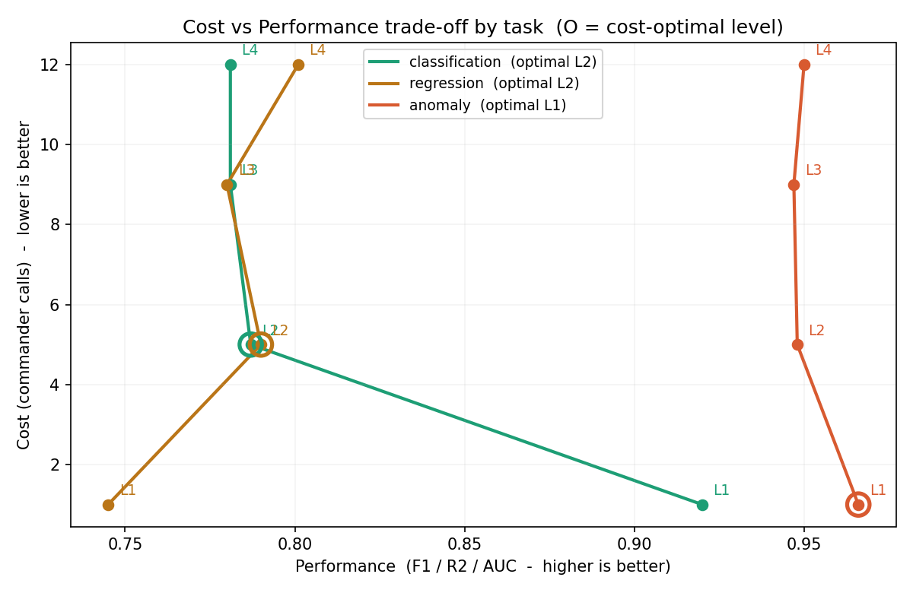

# 방식 A 평가 — 성능 ↔ 비용 트레이드오프

_총 36런 기준. 비용축 = 커맨더호출. 성능 포화 허용오차 eps = 0.02._

## 태스크별 최적 조율 수준

### classification  (지표: F1)

- **최적 레벨: L2** — 성능 0.787 를 커맨더호출 5(으)로 달성. (완주율 1.0, 점수편차 0.011)
- L2→L3: 성능 -0.006 변화에 커맨더호출 +4 추가 → 추가 비용만큼의 성능 이득 미미 (포화).

### regression  (지표: R2)

- **최적 레벨: L2** — 성능 0.79 를 커맨더호출 5(으)로 달성. (완주율 1.0, 점수편차 0.02)
- L2→L3: 성능 -0.01 변화에 커맨더호출 +4 추가 → 추가 비용만큼의 성능 이득 미미 (포화).

### anomaly  (지표: AUC)

- **최적 레벨: L1** — 성능 0.966 를 커맨더호출 1(으)로 달성. (완주율 0.67, 점수편차 0.034)
- L1→L2: 성능 -0.018 변화에 커맨더호출 +4 추가 → 추가 비용만큼의 성능 이득 미미 (포화).

## 종합

태스크 복잡도에 따라 요구되는 조율 수준이 다름: classification=L2, regression=L2, anomaly=L1.
